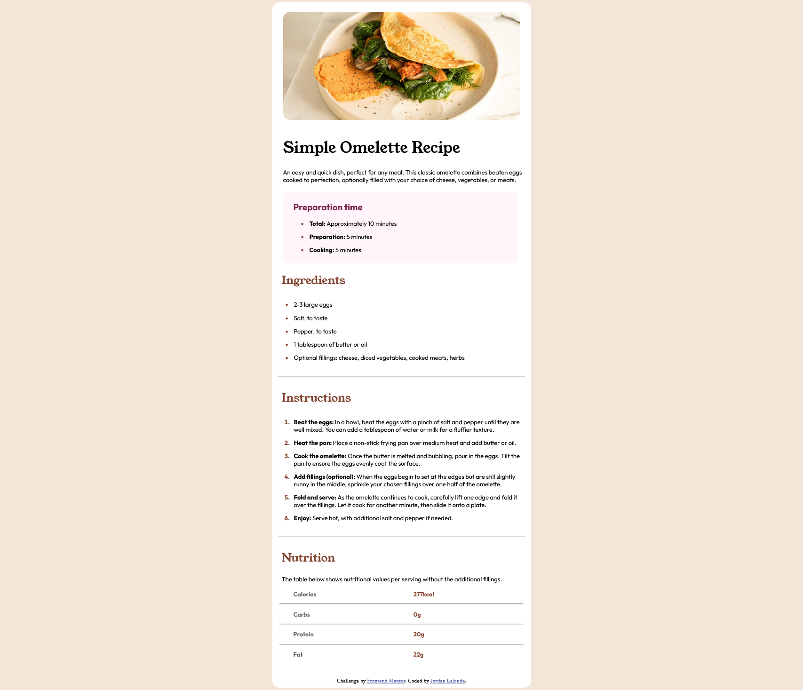

## Table of contents

- [Overview](#overview)
  - [Screenshot](#screenshot)
  - [Built with](#built-with)
  - [What I learned](#what-i-learned)
  - [Continued development](#continued-development)

## Overview

### Screenshot

### Built with

- Semantic HTML5 markup
- CSS custom properties
- Flexbox

### What I learned

I learn to use the table element to make the nurtrition part of the website. I tried to replicate the site as much as possible with the knowledge of 1 week.

### Continued development

I want to focus more on the tag in HTML and to be able to give better class to my div elements.
